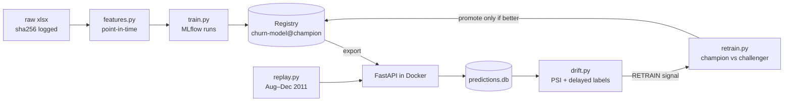

# Customer churn: full MLOps lifecycle


**Live API: https://churn-mlops-pbf8.onrender.com** (opens the interactive docs; on the free plan the first request after idle takes 30 to 60 seconds)

Predict which customers of a UK online retailer will **stop buying in the next 90 days**. The project goes past the model to cover experiment tracking, a model registry, CI, a containerised API, and drift monitoring on replayed "production" traffic.

The data is [UCI Online Retail II](https://archive.ics.uci.edu/dataset/502/online+retail+ii): about 780k cleaned transactions from 5,878 customers, Dec 2009 to Dec 2011.



## Quickstart

```bash
uv sync
make data      # download + clean -> data/transactions.parquet
make train     # sweep, register best as @champion, export to ./model
make serve     # API on :8000   (or: make docker && make docker-run)
make replay    # in a 2nd shell: send Aug–Dec 2011 snapshots as live traffic
make drift     # reports/drift.png + reports/drift.csv; prints RETRAIN if needed
make retrain   # champion/challenger: promotes only if better with confidence
make mlflow    # browse runs and the registry
make test      # ruff + pytest (what CI runs)
```

## 1. Problem framing

**Label.** At snapshot date T, for every customer who bought in the 180 days before T: `churn = 1` if they make no purchase in `[T, T+90d)`.

I chose a 90-day horizon because 80% of gaps between a customer's purchases are 76 days or less (the median is 24). A customer silent for 90 days is outside normal behaviour.

**Snapshots** are taken monthly. Features use only transactions *strictly before* T. `tests/test_features.py` enforces this: it adds future transactions and asserts the features don't change. Changing `<` to `<=` makes the test fail, which I checked.

**Temporal split with embargo.** Each split's last label window ends before the next split's first snapshot, so no training label looks into the validation or test period:

| split | snapshots | rows | churn rate |
|---|---|---|---|
| train | 2010-06 → 2010-10 | 13,989 | 0.44 |
| val (model selection) | 2011-01 → 2011-02 | 6,774 | 0.61 |
| test (reported once) | 2011-06 → 2011-07 | 5,383 | 0.49 |
| prod (replayed through the API) | 2011-08 → 2011-12 | 15,112 | 0.44 / 0.39 (Aug / Sep; later months not yet matured) |

The churn rate moves a lot between periods (post-Christmas lapse in Jan–Feb), which is one more reason a random split would hide problems. A random split would also mix the same customer's future and past snapshots across train and test, which inflates every metric.

## 2. Experiments

The candidates are a logistic-regression baseline (signed-log + scaling) and a 16-config grid of `HistGradientBoostingClassifier`.

Every MLflow run logs:
- parameters, the feature list, the raw-data SHA256 and the git commit
- validation metrics

Only the best run by validation PR-AUC is scored on test, with a **bootstrap 95% CI** (1,000 resamples) and a paired CI for its gain over the baseline. It is then registered as `churn-model` and given the `@champion` alias.

Metrics:
- **PR-AUC** is the selection metric (better than ROC-AUC under class imbalance).
- **Brier score** measures calibration.
- **Precision and lift on the top 10%** are the business metric: if retention can only contact 10% of customers, how many of them are real churners?

| model | val PR-AUC | test PR-AUC (95% CI) | test ROC-AUC | test Brier | precision@10% | lift@10% |
|---|---|---|---|---|---|---|
| v3 logreg baseline | 0.791 | – | – | – | – | – |
| **v3 HGB (champion)** | **0.796** | **0.691** (0.671–0.712) | 0.749 | 0.203 | 0.73 | 1.49× |
| v2 HGB (with `tenure_days`) | 0.813 | 0.712 | 0.758 | 0.207 | 0.81 | 1.66× |
| v1 HGB (lifetime features) | 0.851 | 0.827 | 0.780 | 0.233 | 0.90 | 1.44× |

**Gradient boosting is not significantly better than logistic regression.** The paired bootstrap CI for the gain on test is −0.021 to +0.001. RFM-style features are close to linear in log space. Selection by validation picked boosting, but a reasonable alternative rule is "prefer the simpler model unless the complex one wins with confidence".

v1's higher PR-AUC is **not** a better model. See section 4.

## 3. Serving

- `GET /` is the **Retention Console**, a business-facing page served by the API itself (`src/churn/console.html`, no build step). It shows a sample account book ranked by churn risk with tiers and recommended actions, expected spend at risk, the serving model's holdout metrics, and a what-if simulator whose sliders score live against the model. Simulations send `log: false`, so they never count as production traffic in drift monitoring.
- `GET /model` returns the serving model's version, training window and holdout metrics.
- `POST /predict` takes `{as_of, instances: [...]}` (up to 10k rows). It returns probabilities plus the model version.
- `GET /health` returns status and the model version.
- Input is validated with Pydantic: missing or non-numeric fields and NaN/inf return 422.
- Every prediction is appended to SQLite with `as_of`, `model_version`, `score`, and the features as JSON. JSON means the log survives feature changes between model versions. (This went wrong when v2 shipped with v1's column layout: the first replay got HTTP 500s.)

The current `@champion` is exported from the registry into `model/` and **committed**. The Docker image bakes it in, so the container runs anywhere with no registry access, and promoting a model means a PR that changes `model/`, which goes through CI like any code change. The image runs as a non-root user and listens on `$PORT` (default 8000) for hosting platforms.

## 4. Monitoring: what drift actually found

`scripts/replay.py` scores each month from Aug to Dec 2011 through the API as if it were live traffic.

`churn.drift` compares each month's logged features and scores against the training distribution using **PSI** (10 quantile bins; PSI > 0.2 raises an alert). Once 90 days have passed it also joins the **delayed ground truth** back to the logged predictions.

**v1 → v2 is the most interesting result in this repo.**

v1 used lifetime features (`tenure_days`, `n_invoices`, `spend_total`, `n_products`) and a 365-day population. Monitoring flagged 8 of 12 features as drifting in every month, with PSI for `tenure_days` around 2.4. Predicted churn was 0.38 while actual churn was 0.57.

The cause was **not** customer behaviour: it was dataset construction. The data starts in Dec 2009, so in 2010 training snapshots tenure was capped at under a year and recency at under a few months. By late 2011 those caps were gone. The model had learned that "long history = loyal", saw longer histories in production, and under-predicted churn. v1's test PR-AUC looked better partly because its 365-day population included long-dormant customers who were easy to call as churners (base rate 0.62 vs 0.49).


**Fix (v2):** a fixed 180-day lookback for the population and every feature, tenure clipped to 180 days, and training started at 2010-06, the first month with a full lookback. Result:


| | v1 | v2 |
|---|---|---|
| features with PSI > 0.2 (Aug 2011) | 8 | 1 (`tenure_days`) |
| predicted vs actual churn, Aug 2011 | 0.38 vs 0.57 | 0.40 vs 0.44 |
| predicted vs actual churn, Sep 2011 | 0.38 vs 0.51 | 0.40 vs 0.39 |
| Brier vs constant predictor (test) | 0.233 vs 0.236 (no skill) | 0.207 vs 0.250 |

v2 still had one drifting feature: `tenure_days` (PSI around 0.6). Tenure is left-censored by the dataset start, so the share of customers at the 180-day cap grows as the data ages.

**v3 drops `tenure_days`.** That is a trade-off:

| | v2 | v3 |
|---|---|---|
| features with PSI > 0.2 (any month) | 1 | **0** |
| score PSI, Aug → Dec 2011 | 0.14 → 0.18 | **0.005 → 0.018** |
| predicted vs actual churn, Aug 2011 | 0.40 vs 0.44 | **0.45 vs 0.44** |
| predicted vs actual churn, Sep 2011 | 0.40 vs 0.39 | 0.44 vs 0.39 |
| production PR-AUC, Aug / Sep | **0.675 / 0.609** | 0.646 / 0.595 |
| test PR-AUC | **0.712** | 0.691 |

v3 gives up about 0.02 PR-AUC for inputs and scores that are stable over time. I chose stability: a model whose inputs drift by construction cannot be monitored meaningfully, because every alert is noise.


The remaining movement is real seasonality. `spend_trend` and `recency_days` rise in December (the Christmas ramp), which the Jun–Oct training window does not cover.

## 5. Retraining: champion vs challenger

`make drift-check` (`python -m churn.drift --check`) exits with code 1 and prints `RETRAIN` when either:
- the latest month's score PSI is above 0.2, or
- a month with matured labels has PR-AUC more than 0.05 below the champion's holdout PR-AUC.

For v3 it fired: `2011-09-01 PR-AUC 0.595 < floor 0.641`.

`make retrain` then runs `churn.retrain`:
1. Train a **challenger** with the champion's model family and hyperparameters on **every matured snapshot** (Jun 2010 – May 2011, 37k rows, now including a Christmas season), with an embargo before the evaluation window.
2. Score the champion and the challenger on the **same most recent matured months** (Aug–Sep 2011, 5.5k rows).
3. **Promote only if both hold:**
   - *Primary metric:* the 90% paired-bootstrap CI for the PR-AUC gain is entirely above 0.
   - *Guardrail:* Brier score (calibration) is not worse by more than 0.005.
4. If promoted, register a new version, move `@champion`, and export to `model/`. The decision and both models' metrics are logged to MLflow either way.

The first run:

```
champion v3: PR-AUC 0.6202  Brier 0.2028
challenger:  PR-AUC 0.6305  Brier 0.2126
PR-AUC gain 90% CI [+0.0013, +0.0199]: significant
Brier change +0.0098 (guardrail +0.005): FAILED
KEEP champion
```

The challenger ranks customers better, and the gain is statistically real. But it is worse calibrated, because its training window includes the high-churn post-Christmas months, so its probabilities run high in late summer. **An earlier version of this script checked only PR-AUC and promoted it.** I rolled that back and added the guardrail. The next step is to calibrate the challenger on recent data (isotonic regression), which should let it pass.

## 6. CI

`.github/workflows/ci.yml` runs on every PR and push to `main`:
- `ruff`
- `pytest`:
  - the leakage test and label tests
  - a **model quality gate** (a boosting model must reach PR-AUC > 0.75 on synthetic data with a planted signal)
  - an API contract test that also checks prediction logging
  - a check that the committed `model/` accepts the current feature set
  - a check that the bootstrap detects a real gain and reports none for identical models
- `docker build`, then a **container smoke test**: start the image, check `/health`, send a real prediction request, and confirm bad input returns 422
- A PR that makes features include snapshot-day transactions is blocked by the leakage test:


The tests use synthetic data or the committed model, so CI never needs the dataset.

## 7. Model card

| | |
|---|---|
| **Model** | `churn-model` v3, `HistGradientBoostingClassifier`, 10 features (`model/meta.json`) |
| **Intended use** | Rank existing customers by risk of no purchase in the next 90 days, to prioritise retention outreach |
| **Population** | Customers with at least one purchase in the 180 days before the scoring date |
| **Training data** | Monthly snapshots Jun–Oct 2010 of UCI Online Retail II (UK online gift retailer, mostly wholesale buyers) |
| **Holdout performance** | Test (Jun–Jul 2011): PR-AUC 0.691 (95% CI 0.671–0.712), base rate 0.49, ROC-AUC 0.749, Brier 0.203, lift 1.49× in the top 10% |
| **Production performance** | Aug / Sep 2011 replay: PR-AUC 0.646 / 0.595; predicted churn 0.45 / 0.44 vs actual 0.44 / 0.39 |
| **Not for** | Individual decisions with legal or financial effect; new customers with no purchase history; other retailers without retraining |
| **Known limits** | No Christmas season in training, so Q4 scores start to drift. Not significantly better than logistic regression. Callers send precomputed features (training/serving skew risk). Retrain trigger currently fires on Sep 2011 PR-AUC |
| **Monitoring** | PSI per feature and score vs training data; delayed-label PR-AUC; retrain trigger in `churn.drift --check` |

## 8. Deploying

**Live demo: Render** (free plan) at https://churn-mlops-pbf8.onrender.com. `render.yaml` is a Render Blueprint: it builds the `Dockerfile`, which already contains the committed `model/`, and deploys `main` only after GitHub CI passes (`autoDeployTrigger: checksPass`). So the chain is: PR, CI, merge, CI on `main`, deploy. A new model only reaches the live demo after its `model/` change passes CI.

Setup, once: in the Render dashboard choose **New, Blueprint**, pick this repo, and click **Apply**.

The root URL opens the Retention Console. Developers use `/docs`, where **POST /predict, Try it out** is prefilled with a fading and an active customer.

Free-plan limits: the service sleeps after about 15 minutes without traffic, so the first request after that takes 30 to 60 seconds; open `/health` once before a demo. Predictions are logged to SQLite inside the container, so the log resets on every restart or deploy.

I first tried Hugging Face Spaces, but Docker Spaces on free CPU now require a PRO subscription. The image is self-contained and reads `$PORT`, so Cloud Run or Fly.io would also work.

```bash
make docker && make docker-run   # local: http://localhost:8000/docs
```

## 9. What I'd do next at scale

- **Feature store** (Feast or Tecton) so training and serving compute features with the same code from the same point-in-time source. Today the caller sends precomputed features, which is a training/serving skew risk.
- **Batch scoring** as a nightly job writing to the warehouse. Churn is rarely a real-time problem, and the REST API exists mostly to demonstrate serving.
- **Retraining orchestration** (Airflow, Prefect or Dagster) running `drift --check` and `retrain` on a schedule, instead of by hand.
- **Shadow and canary deploys**: serve the challenger in shadow, compare score distributions, then move the alias.
- **Monitoring stack**: Evidently or whylogs for drift, with metrics exported to Prometheus/Grafana and alerts. Predictions logged to a warehouse table, not SQLite.
- **Data versioning** (DVC or lakeFS) once data arrives incrementally. Here a single SHA256 is enough lineage.
- **Calibration and decisioning**: isotonic calibration on recent data, and choosing the contact threshold from campaign cost vs customer value rather than a fixed top 10%.
- **Seasonality**: once there are more than 2 years of history, train on a full year of snapshots so Q4 is in-distribution.
- **Infrastructure**: a remote MLflow server with an S3 artifact store, the container on ECS or Kubernetes, and secrets and IAM handled properly.

## Layout

```
src/churn/   data.py  features.py  train.py  serve.py  drift.py  retrain.py
scripts/     replay.py
model/       current @champion, exported from the registry (baked into the Docker image)
render.yaml  Render Blueprint for the live demo
tests/       test_features.py (leakage, labels)  test_model.py (quality gate, API, model, bootstrap)
reports/     drift_v1.*  drift_v2.*  drift.* (v3)   # committed evidence
```
