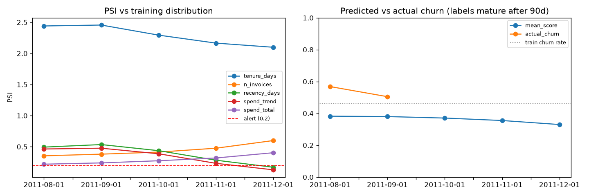
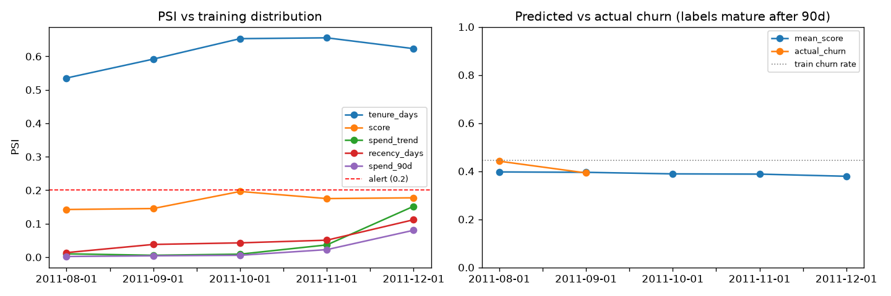
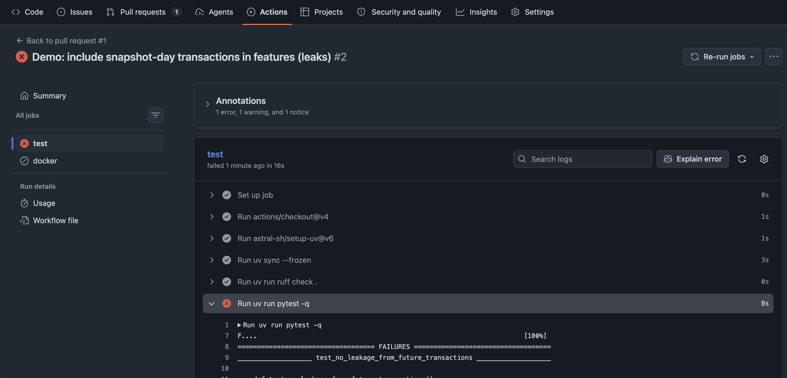

# Customer churn: full MLOps lifecycle

Predict which customers of a UK online retailer will **stop buying in the next 90 days**. The project goes past the model to cover experiment tracking, a model registry, CI, a containerised API, and drift monitoring on replayed "production" traffic.

The data is [UCI Online Retail II](https://archive.ics.uci.edu/dataset/502/online+retail+ii): about 780k cleaned transactions from 5,878 customers, Dec 2009 to Dec 2011.

```mermaid
flowchart LR
    A[raw xlsx<br/>sha256 logged] --> B[features.py<br/>point-in-time]
    B --> C[train.py<br/>MLflow runs]
    C --> D[(Registry<br/>churn-model@champion)]
    D -->|export| E[FastAPI in Docker]
    F[replay.py<br/>Aug–Dec 2011] --> E
    E --> G[(predictions.db)]
    G --> H[drift.py<br/>PSI + delayed labels]
    H -.->|retrain| C
```

## Quickstart

```bash
uv sync
make data      # download + clean -> data/transactions.parquet
make train     # sweep, register best as @champion, export to ./model
make serve     # API on :8000   (or: make docker && make docker-run)
make replay    # in a 2nd shell: send Aug–Dec 2011 snapshots as live traffic
make drift     # reports/drift.png + reports/drift.csv
make mlflow    # browse runs and the registry
make test      # ruff + pytest (what CI runs)
```

## 1. Problem framing

**Label.** At snapshot date T, for every customer who bought in the 180 days before T: `churn = 1` if they make no purchase in `[T, T+90d)`.

I chose a 90-day horizon because 80% of gaps between a customer's purchases are 76 days or less (the median is 24). A customer silent for 90 days is outside normal behaviour.

**Snapshots** are taken monthly. Features use only transactions *strictly before* T. `tests/test_features.py` enforces this: it adds future transactions and asserts the features don't change. Changing `<` to `<=` makes the test fail, which I checked.

**Temporal split with embargo.** Each split's last label window ends before the next split's first snapshot, so no training label looks into the validation or test period:

| split | snapshots | rows | churn rate |
|---|---|---|---|
| train | 2010-06 → 2010-10 | 13,989 | 0.44 |
| val (model selection) | 2011-01 → 2011-02 | 6,774 | 0.61 |
| test (reported once) | 2011-06 → 2011-07 | 5,383 | 0.49 |
| prod (replayed through the API) | 2011-08 → 2011-12 | 15,112 | 0.44 / 0.39 (Aug / Sep; later months not yet matured) |

The churn rate moves a lot between periods (post-Christmas lapse in Jan–Feb), which is one more reason a random split would hide problems. A random split would also mix the same customer's future and past snapshots across train and test, which inflates every metric.

## 2. Experiments

The candidates are a logistic-regression baseline (signed-log + scaling) and a 16-config grid of `HistGradientBoostingClassifier`.

Every MLflow run logs:
- parameters, the feature list, the raw-data SHA256 and the git commit
- validation metrics

Only the best run by validation PR-AUC is scored on test. It is then registered as `churn-model` and given the `@champion` alias.

Metrics:
- **PR-AUC** is the selection metric (better than ROC-AUC under class imbalance).
- **Brier score** measures calibration.
- **Precision and lift on the top 10%** are the business metric: if retention can only contact 10% of customers, how many of them are real churners?

| model | val PR-AUC | test PR-AUC | test ROC-AUC | test Brier | precision@10% | lift@10% |
|---|---|---|---|---|---|---|
| v2 logreg baseline | 0.795 | – | – | – | – | – |
| **v2 HGB (champion)** | **0.813** | **0.712** | 0.758 | 0.207 | 0.81 | 1.66× |
| v1 HGB (lifetime features) | 0.851 | 0.827 | 0.780 | 0.233 | 0.90 | 1.44× |

Gradient boosting beats the linear baseline, but only by a little: RFM-style features are close to linear in log space.

v1's higher PR-AUC is **not** a better model. See section 4.

## 3. Serving

- `POST /predict` takes `{as_of, instances: [...]}` (up to 10k rows). It returns probabilities plus the model version.
- `GET /health` returns status and the model version.
- Input is validated with Pydantic: missing or non-numeric fields and NaN/inf return 422.
- Every prediction is appended to SQLite with `as_of`, `model_version`, `score`, and the features as JSON. JSON means the log survives feature changes between model versions. (This went wrong when v2 shipped with v1's column layout: the first replay got HTTP 500s.)

The model is mounted into the container rather than baked in, so one image serves any registry version.

## 4. Monitoring: what drift actually found

`scripts/replay.py` scores each month from Aug to Dec 2011 through the API as if it were live traffic.

`churn.drift` compares each month's logged features and scores against the training distribution using **PSI** (10 quantile bins; PSI > 0.2 raises an alert). Once 90 days have passed it also joins the **delayed ground truth** back to the logged predictions.

**v1 → v2 is the most interesting result in this repo.**

v1 used lifetime features (`tenure_days`, `n_invoices`, `spend_total`, `n_products`) and a 365-day population. Monitoring flagged 8 of 12 features as drifting in every month, with PSI for `tenure_days` around 2.4. Predicted churn was 0.38 while actual churn was 0.57.

The cause was **not** customer behaviour: it was dataset construction. The data starts in Dec 2009, so in 2010 training snapshots tenure was capped at under a year and recency at under a few months. By late 2011 those caps were gone. The model had learned that "long history = loyal", saw longer histories in production, and under-predicted churn. v1's test PR-AUC looked better partly because its 365-day population included long-dormant customers who were easy to call as churners (base rate 0.62 vs 0.49).



**Fix (v2):** a fixed 180-day lookback for the population and every feature, tenure clipped to 180 days, and training started at 2010-06, the first month with a full lookback. Result:



| | v1 | v2 |
|---|---|---|
| features with PSI > 0.2 (Aug 2011) | 8 | 1 (`tenure_days`) |
| predicted vs actual churn, Aug 2011 | 0.38 vs 0.57 | 0.40 vs 0.44 |
| predicted vs actual churn, Sep 2011 | 0.38 vs 0.51 | 0.40 vs 0.39 |
| Brier vs constant predictor (test) | 0.233 vs 0.236 (no skill) | 0.207 vs 0.250 |

What's left:
- **`tenure_days` still drifts** (PSI around 0.6). The share of customers at the 180-day cap grows as the dataset ages. Next step: drop it, or wait until there are a full 12 months of history before the first training snapshot.
- **Score PSI rises toward 0.2 in Q4.** `spend_trend` and `recency_days` start to move in December. This is real seasonality (the Christmas ramp), which training (Jun–Oct) only partly covers.
- **Production PR-AUC (0.68 Aug, 0.61 Sep) is below test (0.71).** That is expected decay, and it's the signal a retraining trigger should watch, rather than PSI alone.

## 5. CI

`.github/workflows/ci.yml` runs on every PR and push to `main`:
- `ruff`
- `pytest`: the leakage test, label tests, a **model quality gate** (a boosting model must reach PR-AUC > 0.75 on synthetic data with a planted signal), and an API contract test that also checks prediction logging
- `docker build`
- A PR that makes features include snapshot-day transactions is blocked by the leakage test:



The tests use synthetic data, so CI never needs the dataset.

## 6. What I'd do next at scale

- **Feature store** (Feast or Tecton) so training and serving compute features with the same code from the same point-in-time source. Today the caller sends precomputed features, which is a training/serving skew risk.
- **Batch scoring** as a nightly job writing to the warehouse. Churn is rarely a real-time problem, and the REST API exists mostly to demonstrate serving.
- **Retraining orchestration** (Airflow, Prefect or Dagster), triggered on a schedule *and* when delayed-label PR-AUC drops below a floor. The challenger is promoted only if it beats `@champion` on the same recent window.
- **Shadow and canary deploys**: serve the challenger in shadow, compare score distributions, then move the alias.
- **Monitoring stack**: Evidently or whylogs for drift, with metrics exported to Prometheus/Grafana and alerts. Predictions logged to a warehouse table, not SQLite.
- **Data versioning** (DVC or lakeFS) once data arrives incrementally. Here a single SHA256 is enough lineage.
- **Calibration and decisioning**: isotonic calibration on recent data, and choosing the contact threshold from campaign cost vs customer value rather than a fixed top 10%.
- **Seasonality**: once there are more than 2 years of history, train on a full year of snapshots so Q4 is in-distribution.
- **Infrastructure**: a remote MLflow server with an S3 artifact store, the container on ECS or Kubernetes, and secrets and IAM handled properly.

## Layout

```
src/churn/   data.py  features.py  train.py  serve.py  drift.py
scripts/     replay.py
tests/       test_features.py (leakage, labels)  test_model.py (quality gate, API)
reports/     drift_v1.*  drift.*        # committed evidence
```
